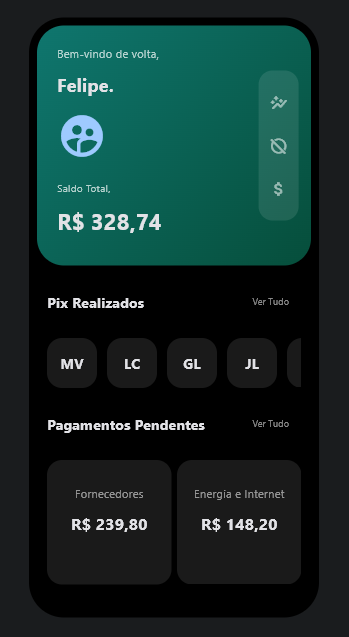

# UI Bank App



Esta é uma UI de um aplicativo móvel bancário simples, desenvolvido como parte de um projeto de estudo. O aplicativo exibe informações básicas do usuário, como nome, foto e saldo total, e mostra a funcionalidade de alternar entre diferentes telas, como investimentos e pagamentos. (Esta última, não implementado, mas a UI está lá)

## Funcionalidades

- Exibição de informações do usuário, incluindo nome, foto e saldo total.
- Navegação entre telas de investimento, ocultação de informações sensíveis e pagamentos/transferências (não funcionais).
- Tela de pagamentos e transferências, exibindo transações PIX realizadas e pagamentos pendentes.

## Estrutura do Projeto

- `main.py`: Arquivo principal do aplicativo que deve ser executado.
- `src/components/`: Pasta contendo os componentes do aplicativo, incluindo `grid_payments.py`, `grid_transfers.py` e `icons_expense.py`.
- `src/components/expense.py`: Arquivo da tela principal do aplicativo.

## Como Rodar o Projeto

Para executar o projeto, siga as etapas abaixo:

1. Certifique-se de ter o Python instalado. Caso contrário, baixe e instale a partir do [site oficial do Python](https://www.python.org/downloads/).
2. Clone o repositório em seu ambiente de desenvolvimento.
3. Crie um ambiente virtual (opcional, mas recomendado):
- python -m venv venv
4. Ative o ambiente virtual:
- No Windows:
  ```
  venv\Scripts\activate
  ```
- No MacOS/Linux:
  ```
  source venv/bin/activate
  ```
5. Instale as dependências do projeto:
    ```
    pip install -r requirements.txt
    ```
6. Execute o aplicativo:
    ```
    flet -r main.py
    ```
